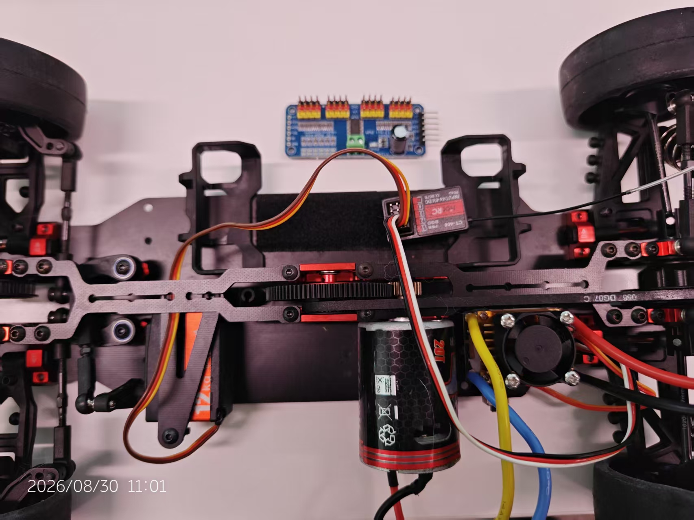
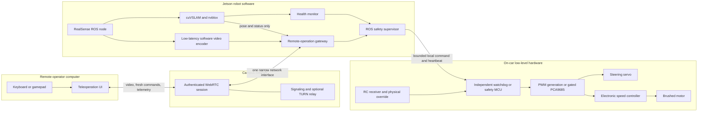
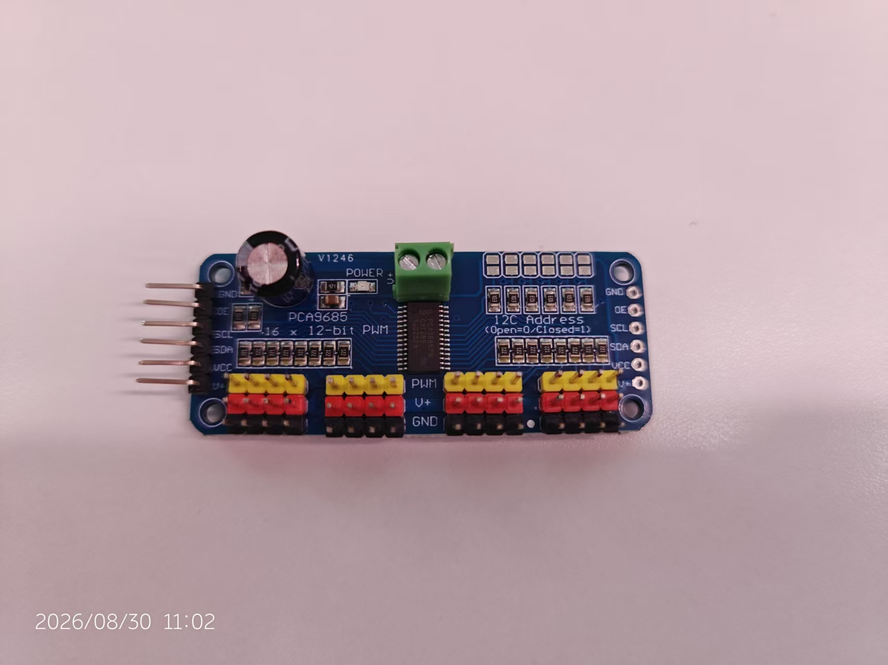
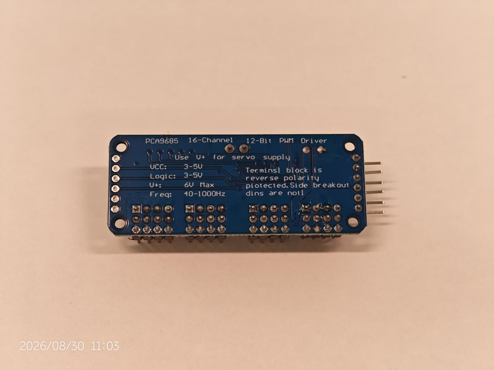

# Future vehicle integration

## Status and scope

This document describes proposed work. None of the motion-control or remote
operation components described here are implemented by the current repository.
`./roscar status` currently reports camera, visual-odometry, and nvblox dense
reconstruction readiness independently. None of those states authorizes the
vehicle to move.

The next vehicle milestone is **human-operated remote driving**:

- the Jetson and car connect through the campus Wi-Fi network;
- a remote operator sees a low-latency view from the car;
- the operator sends steering and throttle intent from a keyboard or gamepad;
- safety decisions and actuator timeouts remain on the car; and
- the car stops locally when commands, video, software, or the network fail.

Autonomous exploration is a later project. Its major building blocks are
outlined near the end, but they are deliberately excluded from the first
remote-driving implementation.

## What exists today

| Item | Current role and limitation |
| --- | --- |
| Jetson Orin Nano Super | Runs the existing ROS 2 perception container; it has no vehicle-control software yet |
| RealSense D435i | Supplies stereo infrared, depth, and color; it needs a rigid forward-facing chassis mount |
| Car chassis | Contains a steering servo, brushed motor, electronic speed controller (ESC), and radio-control (RC) receiver |
| PCA9685 board | Produces pulse-width modulation (PWM) control signals; it is not a motor driver or safety watchdog |
| Current `roscar` stack | Produces odometry-only visual SLAM (VSLAM), bounded nvblox reconstruction, health status, and local RViz visualization |

*Candidate vehicle hardware before integration. The loose PCA9685 board is
shown for reference; this photograph does not establish that it is wired or
configured.*

The exact servo, ESC, motor, receiver, battery, and regulator models were not
legible in the available photographs. Their electrical behavior must be
identified rather than inferred from appearance.

A **deadman** is an input the operator must keep holding for motion to remain
permitted. A **watchdog** is a separate timer that disables output unless fresh
heartbeats continue to arrive. I2C is the short, board-level communication bus
that can connect the Jetson and PCA9685; it is not a campus-network protocol.

## Target behavior

A normal session should look like this:

1. The car boots disarmed and starts the existing perception stack.
2. The operator opens an authenticated application and selects this specific
   vehicle.
3. The application shows live forward video, connection quality, safety state,
   battery state when available, and perception health.
4. The operator explicitly arms the vehicle while holding a deadman control.
5. The application sends bounded steering and throttle/brake requests. It does
   not send PWM pulse widths or direct I2C operations.
6. Robot-side software validates each request and passes it to an independent
   low-level safety controller.
7. Releasing the deadman, losing fresh video, losing the command heartbeat, or
   detecting a local fault returns the ESC to its verified safe state.

The operator remains responsible for choosing where to drive. VSLAM and nvblox
provide pose, visualization, and situational information, but do not choose a
route or generate actuator commands during this milestone.

## End-to-end architecture

The diagram shows responsibilities, not a requirement that every box be a
separate container or ROS process. `./roscar up` should remain the one operator
command even if a least-privilege network gateway becomes a separate Compose
service. The watchdog is outside Docker so a Jetson or container failure cannot
leave a stale drive command active.

## Responsibility boundaries

| Component | Owns | Must not own |
| --- | --- | --- |
| Operator UI | Human input, current video, visible connection and safety state | PWM calibration or the final decision to keep moving after a disconnect |
| Network gateway | Authentication, one control session, video transport, command decoding | Direct I2C access or unbounded actuator output |
| ROS safety supervisor | Command limits, mode state, freshness checks, health interlocks | The only actuator watchdog |
| Low-level safety controller | Final timeout, neutral/brake output, output enable, manual override | Mapping or network session logic |
| PCA9685, if retained | Two low-current PWM control signals | Servo or motor power, watchdog policy |
| ESC | Motor power, direction, and braking according to its verified behavior | Network or ROS decisions |
| Current perception stack | Camera data, visual odometry, local dense reconstruction | Permission to move |

Only one component should be allowed to command the actuators at a time. A mode
manager or hardware multiplexer must select remote teleoperation, manual RC, or
future autonomy. Multiple PWM outputs must never be wired together.

## Campus Wi-Fi link

### Use an application gateway, not the whole ROS graph

The operator computer should not need to join the robot's ROS 2 graph. ROS 2's
Data Distribution Service (DDS)-based discovery and high-bandwidth camera
topics are useful on a controlled robot network, but exposing them directly
across a shared campus network creates a large, fragile interface. Multicast
discovery may also be filtered between wireless clients or virtual LANs
(VLANs).

Instead, one robot-side gateway should expose only:

- one compressed forward-video stream;
- fresh steering and throttle/brake requests;
- a deadman and latched remote stop request;
- low-rate telemetry and health; and
- session setup and authentication.

Keeping ROS traffic local is a future implementation requirement, not a fact
about the present Compose file. The current container uses host networking and
privileged mode, with no DDS interface restriction. Before campus operation:

- bind DDS to loopback or an explicitly allowlisted internal interface using a
  tested middleware profile;
- expose and firewall only the gateway's required listening ports;
- run the externally reachable gateway without hardware privileges, preferably
  in its own least-privilege service; and
- give an actuator driver access only to the selected I2C, serial, or CAN
  device, not every host device.

One Compose project can enforce those boundaries while preserving one-command
startup and one repository. If the gateway and core remain in one privileged
container, the separation is only a software convention and must not be
described as security isolation.

The gateway translates accepted operator input into a robot-level control
message. Calibration from physical or normalized intent to PWM remains on the
robot, so a network client cannot request arbitrary electrical signals. Once
measured speed feedback exists, the standard
`ackermann_msgs/AckermannDriveStamped` interface is a suitable boundary.

### Proposed transport

WebRTC is a good first transport to evaluate because one session can carry
congestion-controlled video and bidirectional data, and its media and data
channels are encrypted. A browser-based operator UI is then possible without
custom video-player installation. WebRTC data channels support reliable and
partially reliable delivery. Configure the drive-command channel as unordered
and partially reliable, using either a small packet lifetime or a low retransmit
limit. Do not configure both. Keep only the latest unsent command and use the
channel's buffered-amount feedback so congestion cannot build a stale control
queue. A separate reliable message can request a latched stop; that remote
request is not a substitute for the physical emergency disconnect.

WebRTC still needs a small HTTPS signaling service to introduce the peers.
Direct peer-to-peer traffic may fail when campus access points isolate clients
or place them behind different firewalls. An approved Traversal Using Relays
around NAT (TURN) service reachable by both endpoints should therefore be
treated as a deployment possibility, not an afterthought. It could run on an
approved campus host; no particular cloud service is required. The connection
path must be tested on the actual campus SSID and in every intended operating
area.

Before implementation, confirm with campus IT or a controlled experiment:

- whether wireless clients can reach one another;
- whether the robot moves between VLANs or access points;
- which UDP and TCP traffic is permitted;
- whether outbound access to a signaling or TURN service is allowed; and
- whether operating a mobile camera on that network complies with campus
  policy.

No campus-wide port should accept anonymous drive commands. Use HTTPS for
signaling, short-lived authenticated sessions, an explicit vehicle identity,
and an authorization rule that grants the control lease to only one operator.
Passwords, private keys, and campus credentials must not be baked into the
Docker image or committed to Git.

### Video path

The initial driving view can reuse the D435i color stream. It must be compressed
rather than sent as raw ROS images. Orin Nano has no NVENC hardware encoder, so
the first candidate is a low-latency software H.264 encoder such as libx264.
Measure its CPU, memory, thermal, and latency cost while cuVSLAM, nvblox, and
RViz are running. A camera-native compressed stream or external encoder is an
option if software encoding cannot meet the measured budget. The video
subscriber and encoder must use a bounded queue and drop old frames under
congestion: a fresh lower-frame-rate image is safer than a smooth view of where
the car was several seconds ago.

The gateway should associate each encoded frame's media timestamp or identifier
with a capture time recorded using the robot's monotonic clock. Each operator
heartbeat echoes the identifier surfaced by a browser callback for the newest
frame actually decoded and drawn. An identifier received only
on a parallel data channel is insufficient because it does not prove that its
image was decoded or displayed. The robot can reject motion when the
acknowledged frame becomes old; a WebRTC “connected” state alone cannot prove
that the operator sees fresh video. The UI must also stop emitting its deadman
heartbeat when the page is hidden, input focus is lost, the controller
disconnects, or no new frame is rendered.

The remote UI should display connection state and measured video quality.
Video resolution, frame rate, bitrate, and acceptable end-to-end latency are
validation results, not values to guess in advance. The initial throttle cap
must be low enough for the worst measured observation, command, and stopping
delay, and should decrease further when network quality degrades.

RViz remains on the Jetson as it is today. The remote operator gets the
purpose-built driving view and compact telemetry rather than an exported RViz
desktop. This reduces bandwidth and keeps vehicle control independent of a GUI
desktop session.

## Command contract

The first network command should express normalized steering and throttle/brake
intent. This is open-loop actuation: without wheel feedback the robot does not
know or regulate its actual speed. A command record needs at least:

| Field | Purpose |
| --- | --- |
| Session and sequence ID | Reject commands from an old operator or commands received out of order |
| Robot-issued lease token | Prove that the command answers a still-valid robot-side control epoch |
| Steering request | Bounded left/right intent, calibrated to safe steering output |
| Throttle/brake request | Bounded forward/reverse intent and braking request; not measured speed |
| Deadman held | Motion is allowed only while continuously asserted |
| Last rendered frame ID | Let the robot check video age with its own monotonic clock |
| Stop request | Requests a robot-side latched stop; it is not the physical emergency stop |
| Sender timestamp | Diagnostics and latency measurement, not the only freshness test |

The robot periodically issues a short-lived lease token and records its issue
time locally. Commands must echo the current token, arrive in increasing
sequence order, and reach the robot before that token expires. This prevents a
packet delayed in a network or browser queue from becoming “fresh” merely
because it arrived recently, while avoiding clock synchronization as a safety
dependency.

As an initial experiment, sending at roughly 20 Hz with a timeout around 250 ms
is reasonable, but the final rate and timeout must come from measured Wi-Fi
jitter, verified stopping behavior, and the chosen throttle cap. Expiry enters
a fault/disarmed state and requires a fresh arm handshake. Reconnection always
starts disarmed; queued commands from the previous session are never replayed.

## Safety architecture

Remote teleoperation must assume that Wi-Fi will eventually pause, roam,
disconnect, duplicate packets, or deliver them late. The network is a transport,
not a safety component.

### Robot-side state machine

The safety supervisor should have explicit states:

| State | Output behavior |
| --- | --- |
| `DISARMED` | Actuation disabled; normal boot and reconnect state |
| `ARMED_NEUTRAL` | Valid session exists, but no motion until deadman and fresh command agree |
| `DRIVING` | Bounded fresh command is passed to the low-level controller |
| `FAULT` | Safe ESC state and steering policy are applied; re-arming is required |
| `STOP_LATCHED` | Output is latched safe until a deliberate local reset procedure succeeds |

The transition to a safe state must happen locally on any of these events:

- command or deadman heartbeat expires;
- the last-rendered video-frame acknowledgement expires;
- network session changes or disconnects;
- gateway or ROS safety process exits;
- low-level heartbeat from the Jetson expires;
- power, battery, temperature, or actuator fault is detected; or
- either local physical stop or remote stop is requested.

“Safe ESC state” must be established from the exact ESC model and a test with
the wheels raised. It may mean neutral, active braking, or removing enable/power;
it must not be assumed from a generic pulse width.

### Independent low-level watchdog

Direct Jetson-to-PCA9685 control is acceptable only for early bench tests with
the driven wheels raised and motor power controlled. The PCA9685 can retain its
last output when the controlling process freezes, so it is not a watchdog.

The preferred vehicle design adds a small microcontroller (MCU) with a hardware
watchdog. It receives bounded commands plus a heartbeat and independently
returns to the verified safe state when they expire. Generating both hobby PWM
signals directly on the MCU is the simpler preferred arrangement. Its actuator
outputs or a separate hardware inhibit must default disabled throughout MCU
boot, reset, watchdog reset, and power loss. Firmware never re-arms itself after
a reset; it requires a new explicit arm handshake.

If the PCA9685 is retained, an external pull-up must keep `OE` disabled while
the MCU is booting, reset, or unpowered. The selected PCA9685 disabled-output
mode and the exact servo/ESC response to signal loss must be tested. A high
`OE` disables all channels at once and cannot, for example, disable throttle
while actively centering steering. Its PWM registers can still contain the old
throttle value, so software must write and verify safe values before every
output enable and require a fresh arm handshake. If the ESC does not become
safe when pulses disappear, the MCU must generate its verified safe pulse or
control a separate hardware inhibit.

Retain a physical battery/ESC disconnect. The existing RC receiver can provide
a useful local fallback only through a proper safety controller or PWM
multiplexer with defined priority; its outputs must not be electrically joined
to PCA9685 outputs.

### Electrical constraints from the photographed hardware

| PCA9685 front | PCA9685 back |
| --- | --- |
|  |  |
| I2C and enable pins, address pads, 16 PWM headers, and the separate `V+` terminal are visible. | These are the photographed breakout's own supply and frequency markings; verify the board and every connected device before applying power. |

- The Jetson 40-pin header uses 3.3 V logic. PCA9685 `VCC` should therefore use
  3.3 V, with SDA, SCL, and a common signal ground.
- PCA9685 `V+` is the separate servo-power rail. The photographed board marks
  it as 6 V maximum.
- PCA9685 channels share one PWM frequency. Verify that the servo and ESC accept
  the same rate and that both recognize a 3.3 V signal high.
- Never power the steering servo, ESC, or motor from the Jetson header.
- Size the separate supply, PCB path, connectors, and wiring for servo stall and
  transient current; the board's 6 V marking is a voltage ceiling, not a
  current rating.
- Verify whether the ESC receiver lead contains a BEC output before connecting
  its red wire. A battery eliminator circuit (BEC) is a regulator, and two BEC
  or other regulator outputs must never be paralleled accidentally.
- Fuse the drive and compute power paths appropriately, provide strain relief,
  keep I2C wiring short, and keep motor-current wiring away from camera and I2C
  wiring.

A read-only check found I2C device interfaces on both the current Jetson host
and container. That confirms software access is possible, but does not identify
the correct 40-pin-header bus or prove electrical wiring.

After the power design is reviewed, the provisional signal-side connections
are:

| Jetson Orin Nano J12 | PCA9685 |
| --- | --- |
| Pin 1, 3.3 V | `VCC` logic supply |
| Pin 3, I2C SDA | `SDA` |
| Pin 5, I2C SCL | `SCL` |
| Pin 6, ground | `GND` logic ground |
| Regulated supply positive, verified for the servo and no more than the photographed board's 6 V limit | `V+` servo rail, never Jetson power |
| Regulated supply negative | Common `GND` shared by Jetson/PCA, servo, and ESC signal ground |
| Chosen PWM channel | Steering-servo signal |
| Different chosen PWM channel | ESC signal |

Leave the ESC receiver lead's red wire isolated until its BEC voltage and power
direction are measured and a single-source servo-rail plan is chosen. Plugging
the complete three-wire ESC lead into a PCA9685 channel can connect that red
wire directly to shared `V+` and accidentally parallel regulators.

Exact servo and ESC models, voltage limits, neutral behavior, arming sequence,
and PWM ranges are still unknown. They must be read from labels/manuals and
confirmed by measurement before connecting the Jetson-side electronics.

## Making the chassis a ROS robot

The current system estimates `odom -> camera_link`. A mobile robot also needs a
stable body frame and a geometric model:

1. Create a Unified Robot Description Format (URDF) or xacro model containing
   `base_link`, wheels, steering joints, and the D435i mount.
2. Measure wheelbase, track width, wheel radius, steering limits, and the rigid
   transform from `base_link` to `camera_link`.
3. Publish that fixed transform through the ROS Transform (TF) tree, then change
   cuVSLAM's `base_frame` from `camera_link` to `base_link`. CuVSLAM should be
   the sole changing `odom -> base_link` authority, giving the chain
   `odom -> base_link -> camera_link` without two parents for one frame.
4. Define steering sign and calibrate the requested virtual center steering
   angle against the physical wheels, wheelbase, and turn radius.
5. Calibrate open-loop throttle conservatively against direction and observed
   vehicle speed.
6. Add wheel encoders and battery feedback when practical; neither exists in
   the current software.

The chassis steers like an Ackermann vehicle, so a future closed-loop ROS
interface should describe steering angle and speed rather than pretending it is
a differential-drive robot. Until speed feedback exists, the initial interface
must remain explicit that it requests open-loop throttle. The low-level actuator
driver converts that robot-level command into hardware-specific PWM values.

The camera must be rigidly mounted forward with an unobstructed view and low
vibration. Its camera-to-chassis transform is part of calibration, not a value
to estimate by eye. CuVSLAM currently runs in odometry-only mode, so its pose can
drift and is not a reusable localization map. Nvblox supplies a bounded local
dense reconstruction.

## Packaging and observability

New robot-side ROS packages, launch files, UI assets, configuration, and tests
should be copied into images at build time like the existing stack. Do not mount
the source repository into a running container. Runtime logs and bags can
continue to use the Docker-managed `roscar-data` volume. Device access for a
selected I2C, serial, or Controller Area Network (CAN) interface is a hardware
boundary, not a project source mount.

The current core container is privileged and host-networked for its existing
hardware path. Before accepting campus traffic, either reduce its privileges
and network exposure or put the externally reachable gateway in a separate
unprivileged service with a narrow, authenticated interface to the core. This
is a real security boundary and still permits `./roscar up` to start everything
together. Runtime credentials should be injected as secrets and never copied
into an image layer.

`./roscar up` should eventually start the whole robot-side stack. Its health
report should distinguish at least:

- perception ready;
- video stream ready;
- operator authenticated;
- safety controller reachable;
- command fresh or stale;
- vehicle armed or disarmed; and
- actuator or battery fault.

“Container healthy” and “safe to move” must remain different states. Record
state transitions, command expiry, measured network statistics, and faults with
monotonic timestamps. Avoid recording credentials or unnecessary campus user
information.

## Incremental implementation and validation

Each phase starts disarmed and keeps the legacy workspace untouched.

1. **Inventory and power design.** Identify the servo, ESC, motor, receiver,
   batteries, connectors, and BEC. Draw and review a fused power/ground diagram.
2. **Robot geometry.** Mount the D435i, create the URDF/xacro, measure the
   chassis, and validate the TF tree without connecting motor power.
3. **Actuator bench.** Validate steering direction and limits with the chassis
   raised. Establish the ESC's neutral/arming behavior with driven wheels clear.
4. **Independent safety.** Add the watchdog, hardware output disable, physical
   disconnect, state machine, command limits, and fault reporting. Prove that
   killing each Jetson process stops output.
5. **Local teleoperation.** Drive at very low, capped throttle with the operator
   beside the car. Measure observed speed and braking distance, and verify
   direction, deadman behavior, and manual override before involving Wi-Fi.
6. **Video and campus link.** Add measured low-latency video encoding and the
   authenticated gateway. Test simultaneous perception load, same-room
   interference, access-point roaming, relay fallback, latency, packet loss,
   disconnects, reconnects, and exclusive control.
7. **Perception integration.** Add calibrated chassis frames and compact VSLAM
   and nvblox health to the operator UI without making perception a motion
   authority.
8. **Controlled field trial.** Use a cordoned area, conservative throttle cap,
   measured operating speed, local spotter, and physical stop. Repeat injected
   failures and record the worst observed stop response before expanding the
   operating envelope.

Every phase should produce a short test record with hardware revisions,
software commit, measured results, failures, and the reason it is safe to enter
the next phase.

## Later: autonomous exploration

Autonomous exploration should reuse the same actuator, safety, mode-management,
and health layers rather than creating another path to the ESC. The operator's
latched stop request, local physical disconnect, and hardware watchdog remain
higher priority than any planner.

At a high level, autonomy would add:

- sufficiently robust state estimation, likely combining visual odometry with
  validated IMU and wheel information;
- reusable mapping or localization with drift/loop-closure behavior appropriate
  to the operating area;
- a 2D or 3D obstacle representation and a robot footprint;
- global and local planning that supports Ackermann steering constraints;
- a frontier or mission manager that selects unexplored goals;
- collision monitoring, recovery behavior, and a clear
  teleoperation/autonomous mode arbiter; and
- simulation, recorded-data regression tests, and progressively constrained
  physical trials.

The existing odometry-only cuVSLAM plus bounded nvblox reconstruction is useful
input, but is not by itself a complete autonomous navigation system. No
autonomous motion should be added until remote operation and all local stop
paths are repeatable and measured.

This hobby-vehicle plan is not a drive-by-wire design for a road vehicle. The
[full-size laboratory-vehicle roadmap](lab-vehicle-roadmap.md) describes the
separate sensor-mule, replay, shadow-mode, HIL, and closed-course gates needed
to work with the target laboratory's real car and industry equipment.

## Decisions to make before implementation

- Exact servo, ESC, receiver, motor, battery, and BEC specifications
- Safety microcontroller, firmware-update method, and whether PCA9685 remains
- Physical emergency-stop and manual-override mechanism
- Campus network policy, signaling-service location, and TURN requirement
- Operator UI technology and supported keyboard/gamepad controls
- Video codec, profile, camera mount, and acceptable latency envelope
- Initial throttle/output cap, observed speed, and verified stopping distance
- Wheel encoder, battery monitor, and other feedback hardware

These decisions should be recorded before code depends on them. In particular,
do not infer electrical or stopping behavior from generic component appearance.

## References

- [Current architecture](architecture.md)
- [How the current perception stack works](how-it-works.md)
- [Progression to a full-size laboratory vehicle](lab-vehicle-roadmap.md)
- [ROS REP 105: coordinate frames for mobile platforms](https://www.ros.org/reps/rep-0105.html)
- [RFC 8831: WebRTC data channels](https://www.rfc-editor.org/rfc/rfc8831.html)
- [RFC 8827: WebRTC security architecture](https://www.rfc-editor.org/rfc/rfc8827.html)
- [W3C WebRTC API](https://www.w3.org/TR/webrtc/)
- [NXP PCA9685 data sheet](https://www.nxp.com/docs/en/data-sheet/PCA9685.pdf)
- [NVIDIA: software encoding on Orin Nano](https://docs.nvidia.com/jetson/archives/r36.5/DeveloperGuide/SD/Multimedia/SoftwareEncodeInOrinNano.html)
- [Isaac ROS Visual SLAM frame configuration](https://nvidia-isaac-ros.github.io/v/release-3.2/repositories_and_packages/isaac_ros_visual_slam/isaac_ros_visual_slam/index.html)
- [Jetson Orin Nano carrier-board specification](https://developer.nvidia.com/downloads/assets/embedded/secure/jetson/orin_nano/docs/jetson_orin_nano_devkit_carrier_board_specification_sp.pdf)
