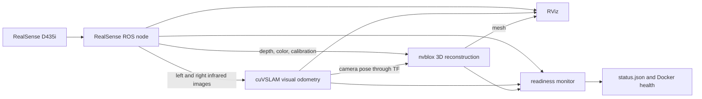

# How roscar works

This guide explains the running system for a computer-science undergraduate
who has not used ROS or robotics before. It describes the current code, not a
future autonomous-car design.

## The one-minute mental model

The RealSense camera produces several timestamped image streams, including a
calibrated stereo pair. One GPU algorithm estimates how the camera moves. A
second GPU algorithm combines that motion with depth images to reconstruct
nearby surfaces. RViz draws the inputs and outputs, while a small monitor checks
that data is still flowing.



An important naming detail: cuVSLAM is configured with
`enable_localization_n_mapping: false`. NVIDIA defines this as
**odometry-only mode**. It tracks motion, but does not perform loop closure or
create a reusable localization map. Nvblox creates the dense 3D reconstruction.

## Minimal ROS 2 vocabulary

| Term | Meaning in ordinary software terms | Example here |
| --- | --- | --- |
| Node | A named software component | `visual_slam_node` |
| Topic | A typed publish/subscribe stream | Infrared images at about 30 Hz |
| Message | One value sent on a topic | One image or one pose |
| Parameter | Configuration attached to a node | Voxel size `0.10` m |
| TF | A time-indexed graph of coordinate transforms | `odom` to `camera_link` |
| Launch file | A program that starts and connects nodes | `roscar.launch.py` |
| ROS graph | All running nodes and their communication links | The complete pipeline |

Topics are asynchronous streams. A publisher does not call a subscriber
directly; the ROS middleware delivers matching messages. This lets camera,
odometry, mapping, monitoring, and visualization run at their own rates.

A Docker container is a packaging and operating-system boundary. It is not a
ROS node. This project uses one container containing several ROS nodes and
several Linux processes.

## Stage 1: camera input

`realsense2_camera_node` talks to the D435i over USB 3 and publishes:

- rectified left and right infrared images at `848x480x30`;
- depth images at the same stereo profile;
- color images at `640x480x30`;
- calibration messages describing each camera's focal length and geometry;
- static TF transforms between `camera_link` and the optical sensor frames.

The principal topics are:

| Topic | Consumer |
| --- | --- |
| `/camera/infra1/image_rect_raw` | cuVSLAM and monitor |
| `/camera/infra2/image_rect_raw` | cuVSLAM |
| `/camera/infra1/camera_info` and `infra2/camera_info` | cuVSLAM |
| `/camera/depth/image_rect_raw` | nvblox and monitor |
| `/camera/depth/camera_info` | nvblox |
| `/camera/color/image_raw` and `/camera/color/camera_info` | nvblox |

“Rectified” means the stereo images have been geometrically corrected so a
point in the left image lies on the same row in the right image. This makes
stereo matching much easier.

The infrared emitter and IMU are disabled. The emitter can place a visible
pattern into the infrared images and disturb visual feature tracking. IMU
fusion remains off until that input is independently validated.

## Stage 2: camera motion from images

The Isaac ROS `VisualSlamNode` receives the two infrared images and their
calibration. Conceptually it:

1. detects distinctive image features;
2. matches features between the left and right images to infer 3D structure;
3. matches features between successive timestamps;
4. finds the camera motion that best explains those matches;
5. publishes the estimated pose and velocity.

Its main output is `/visual_slam/tracking/odometry`. It also publishes the
transform from `odom` to `camera_link` through TF and a path for visualization.

`odom` is a coordinate system whose origin is established when tracking
starts. The estimated transform can be written as
`T_odom_camera(t)`: the pose of the camera at time `t` relative to that origin.
Because this is odometry-only mode, small errors can accumulate into drift and
are not corrected by recognizing a previously visited place.

Although parameters and topics contain names such as `map` and `slam_path`, a
reusable cuVSLAM map is not active in the current configuration. Restarting the
stack establishes a new odometry origin.

### Coordinate frames

A pose is meaningless unless its coordinate frame is known. This project uses
the following frames:

| Frame | Role |
| --- | --- |
| `camera_infra1_optical_frame` | Left infrared sensor coordinates |
| `camera_infra2_optical_frame` | Right infrared sensor coordinates |
| `camera_link` | Common physical frame for the camera body |
| `odom` | Local world frame established when odometry starts |
| `map` | Named in configuration, but not active as a persistent SLAM frame |

The RealSense driver publishes the fixed transforms within the camera. cuVSLAM
publishes the changing `odom -> camera_link` transform. Together they form a TF
chain that lets another node ask where either optical sensor was at any image
timestamp.

## Stage 3: dense 3D reconstruction

Nvblox combines three kinds of information:

- a depth image, which says how far each visible pixel is from the camera;
- camera calibration, which converts pixels into 3D rays;
- TF, which says where the camera was when the image was captured.

For each depth pixel, nvblox first obtains a point in the camera's coordinate
frame and then transforms it into `odom`:

```text
point_in_odom = T_odom_camera × point_in_camera
```

It fuses many such observations into a GPU-resident voxel grid. A voxel is a
small 3D cell, analogous to a pixel in a 2D image. This project uses 0.10 m
voxels and a TSDF representation, which stores a signed distance to the nearest
surface. The zero crossing of that field becomes the triangle mesh shown in
RViz.

The reconstruction is bounded to approximately `-5..5` m in X and Y and
`-0.5..2.5` m in Z in the `odom` frame. Depth is integrated at up to 30 Hz,
color at 5 Hz, and the mesh is updated at 5 Hz. The published mesh topic is
`/nvblox_node/mesh`.

The TF dependency is essential. Without `odom -> camera_link`, nvblox would
know the shape seen in one frame but not where to place it relative to earlier
frames.

## Stage 4: visualization

RViz is a viewer, not part of the estimation algorithm. Its fixed frame is
`odom`, and the supplied configuration displays:

- the infrared and color camera feeds;
- the TF coordinate-frame tree;
- the camera trajectory;
- the nvblox triangle mesh;
- a reference grid.

RViz runs on the Jetson and draws through its Xorg display. The container gets
one read-only X11 socket file and a temporary authentication cookie. An RViz or
X11 failure does not necessarily mean the ROS data pipeline has failed.

## Stage 5: readiness monitoring

`roscar_stack_monitor` subscribes to representative outputs and writes
`/var/roscar/status.json` every two seconds.

| Status field | Becomes true when |
| --- | --- |
| `camera_ready` | Infrared and depth images arrived within 5 seconds |
| `vslam_ready` | Odometry arrived within 5 seconds |
| `nvblox_ready` | A mesh arrived within 15 seconds |

Docker's health check separately verifies that the launch, camera, VSLAM,
nvblox, and optional RViz processes exist. It requires fresh camera and VSLAM
data, but reports nvblox mesh readiness separately. This distinction avoids
confusing “the process exists” with “the algorithm is producing data.”

## What `./roscar up` does

The host-side `roscar` script performs the following sequence:

1. verifies the exact base-image ID;
2. finds the active Xorg display and copies its cookie into an environment
   value;
3. asks Docker Compose to build cached layers and start one container;
4. waits for the container health check for up to three minutes;
5. prints the machine-readable readiness report.

Inside the container, the entrypoint sources ROS and the project overlay. One
ROS launch file then starts components in a deliberate order:

| Time after launch | Component |
| --- | --- |
| Immediately | RealSense camera and readiness monitor |
| 2 seconds | cuVSLAM component container |
| 4 seconds | nvblox component container |
| 8 seconds | RViz |

The delays reduce startup races; they do not delay data once a component is
ready. Each major process has ROS launch respawning enabled. Docker also uses
`restart: unless-stopped` for the complete container.

## Why there are component containers inside a Docker container

The two uses of “container” are unrelated:

- The **Docker container** packages Ubuntu, ROS, CUDA libraries, application
  code, and configuration.
- A ROS **component container** is a normal Linux process that dynamically
  loads a C++ ROS node from a shared library.

VSLAM and nvblox each receive a separate ROS component-container process. A
crash in one therefore does not directly terminate the other, while the whole
stack remains one Docker deployment.

## Storage and isolation

Project code and configuration are copied into the Docker image during build.
The host repository is not mounted into the running container.

The Docker-managed `roscar-data` volume is mounted at `/var/roscar` for logs,
bags, maps, and status. Removing and recreating the container leaves this volume
intact. The current launch does not automatically save a reusable cuVSLAM map.

The container uses the NVIDIA runtime for GPU access, host networking for ROS
middleware discovery, host IPC for efficient communication, and privileged
hardware access for the USB camera. Privileged mode is convenient for this
prototype but is broader access than a production deployment should need.

## Inspect the live graph

Open a shell without changing the running stack:

```bash
./roscar shell
source /opt/ros/humble/setup.bash
source /opt/roscar/install/setup.bash
```

Useful read-only commands are:

```bash
ros2 node list --no-daemon
ros2 topic list
ros2 topic hz /camera/infra1/image_rect_raw
ros2 topic hz /visual_slam/tracking/odometry
ros2 topic echo /visual_slam/tracking/odometry --once
ros2 run tf2_ros tf2_echo odom camera_link
ros2 component list
```

Use `Ctrl-C` to stop a command such as `topic hz`; this does not stop the
pipeline.

## Where to read the code

| File | Responsibility |
| --- | --- |
| `roscar` | Host-side commands, image check, X11 setup, health wait |
| `compose.yaml` | Docker runtime, GPU, networking, mounts, restart policy |
| `Dockerfile` | Pinned dependencies and immutable application image |
| `docker/entrypoint.sh` | Container environment and ROS launch handoff |
| `roscar.launch.py` | Nodes, topic remapping, parameters, startup order |
| `config/realsense.yaml` | Camera streams and sensor options |
| `config/nvblox.yaml` | Reconstruction type, rates, resolution, and bounds |
| `stack_monitor.py` | Topic-freshness checks and status JSON |
| `docker/healthcheck.sh` | Docker-level process and data-flow health |
| `rviz/roscar.rviz` | Saved visualization layout |

The ROS package files live below `ros_ws/src/roscar_bringup/`.

## What this project does not yet contain

This is a perception reference stack, not yet a complete autonomous car. It
does not include:

- motor, steering, or safety control;
- a robot model or chassis coordinate frames;
- wheel encoders or fusion with wheel odometry;
- IMU fusion;
- Nav2 path planning and obstacle avoidance;
- automatic map saving or later relocalization;
- a calibrated vehicle-to-camera transform.

These layers can consume the current odometry and reconstruction later, but a
healthy perception stack alone must never be interpreted as permission to move
physical hardware.

## Further reading

- [ROS 2 Humble: nodes](https://docs.ros.org/en/humble/Tutorials/Beginner-CLI-Tools/Understanding-ROS2-Nodes/Understanding-ROS2-Nodes.html)
- [ROS 2 Humble: topics, services, and actions](https://docs.ros.org/en/humble/Concepts/Basic/Interfaces-Topics-Services-Actions.html)
- [Isaac ROS Visual SLAM 3.2](https://nvidia-isaac-ros.github.io/v/release-3.2/repositories_and_packages/isaac_ros_visual_slam/isaac_ros_visual_slam/index.html)
- [Isaac ROS Nvblox 3.2](https://nvidia-isaac-ros.github.io/v/release-3.2/repositories_and_packages/isaac_ros_nvblox/index.html)
