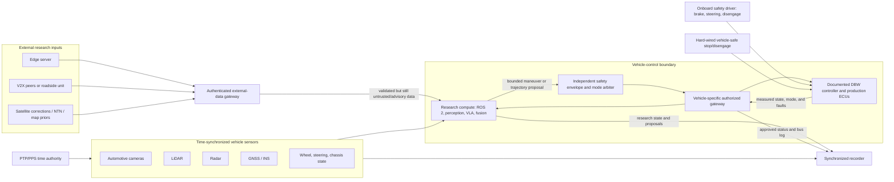

# From roscar to a full-size laboratory vehicle

## Status and purpose

This is a proposed engineering roadmap. The current repository controls no
full-size vehicle and contains no automotive drive-by-wire interface. Nothing
in this document authorizes vehicle modification, CAN transmission, actuator
control, road testing, or operation outside the laboratory's own safety and
approval process.

The goal is not to enlarge the toy-car electronics. It is to build a credible
research-vehicle platform around the laboratory's existing vehicle and
industry-grade equipment:

1. a synchronized passive sensor and data-acquisition vehicle;
2. a reproducible replay and shadow-evaluation platform;
3. a hardware-in-the-loop-tested vehicle interface; and
4. only if the lab authorizes it, a low-speed closed-course demonstrator with
   independent vehicle safety controls.

The current D435i, Jetson container, visual odometry, nvblox, monitoring, and
RViz can contribute to the first two stages. The hobby PCA9685, servo PWM,
brushed-motor ESC calibration, and toy-car safety conclusions do not transfer
to a road vehicle.

## Short glossary

| Term | Meaning here |
| --- | --- |
| Sensor mule | A human-driven vehicle carrying synchronized research sensors and recorders, without research actuator authority |
| Shadow mode | Research software produces and logs decisions but cannot command the vehicle |
| ODD | Operational design domain: the exact roads/course, speed, weather, lighting, traffic, and operator conditions allowed for a function |
| DBW | Drive-by-wire: an authorized electronic interface to steering, braking, propulsion, or gear selection |
| ECU | Electronic control unit already responsible for a vehicle function |
| CAN / CAN FD | Common in-vehicle communication buses; physical access does not imply permission or knowledge of safe command semantics |
| DBC / ARXML | Machine-readable descriptions of vehicle signals and interfaces, often proprietary |
| PTP / PPS | Precision Time Protocol and pulse-per-second references used to synchronize sensors and computers |
| SIL | Software-in-the-loop testing against software models or simulation |
| HIL | Hardware-in-the-loop testing with target hardware and a simulated vehicle, ECU, or electrical environment |
| Safety driver | A trained person physically able and authorized to disengage automation and control the vehicle |
| VLA | Vision-language-action model: a learned model that can propose a maneuver, trajectory, or robot action |
| V2X | Vehicle-to-everything communication with another vehicle, infrastructure, person, or network |
| NTN | Non-terrestrial networking through a satellite or another non-ground platform |

## What transfers from the toy platform

| Reusable idea | What must change for the lab vehicle |
| --- | --- |
| Versioned container image and one-command service orchestration | Use separate least-privilege services, signed/pinned artifacts, hardware manifests, and lab deployment review |
| Camera, odometry, mapping, RViz, and health monitoring | Add automotive sensors, calibrated vehicle frames, synchronized clocks, outdoor/global localization, and measured performance envelopes |
| Command freshness, explicit arming, and fault states | Integrate with the authorized DBW system, vehicle mode manager, safety driver, hard-wired disengage, and vehicle-specific safe response |
| Reproducible configuration and development logs | Add requirements, calibration records, test-case IDs, firmware, container digests, vehicle revision, and traceable evidence |
| Replay before motion | Extend to synchronized sensor/vehicle-bus replay, SIL, HIL, stationary commissioning, and closed-course gates |

The most important transfer is the discipline of explicit interfaces and
reproducible evidence. Raw steering values, throttle maps, timing limits,
mounting geometry, power design, and any claim of safe behavior must be derived
again for the actual vehicle.

## Target architecture



The research computer may propose a maneuver, target trajectory, steering
angle, or acceleration through a bounded, typed, vehicle-independent interface.
It must not send arbitrary CAN frames or bypass the vehicle-specific gateway.
The gateway checks mode, freshness, rate, bounds, interface health, and the
actual vehicle state. Production controllers retain their inner steering,
braking, and propulsion loops.

“Independent” in the safety-envelope box means separately allocated and
failure-contained from the research workload; it does not assert safety
certification.

VLA, V2X, edge, and satellite-derived information remain upstream of the same
boundary. Losing any of them must not prevent local disengagement or the
vehicle-specific safe response.

## Responsibility boundaries

| Layer | Owns | Does not own |
| --- | --- | --- |
| Research models | Perception, prediction, semantic reasoning, candidate trajectory generation | Direct bus writes, arming, braking authority, emergency response |
| Conventional planning/control | Feasible local trajectory and bounded motion request | Permission to engage the real vehicle |
| Safety envelope and mode arbiter | Checks of monitorable ODD conditions, proposal validation, freshness, limits, mode transitions | Production steering/brake loops or proof of procedural conditions such as venue permission |
| Vehicle-specific gateway | Approved protocol, counters/checksums, status conversion, DBW health | Research policy or arbitrary frames |
| Authorized DBW and production ECUs | Physical actuation, feedback, documented disengagement behavior | VLA, SLAM, offloading, or experiment logic |
| Safety driver and test team | Final operational authority, checklist, abort, manual takeover | Quietly compensating for an undocumented unsafe system |
| Edge/V2X/satellite services | Optional information or noncritical compute | Local safety timing or the ability to stop |

## Begin with the laboratory, not the software

Before designing an adapter, obtain the laboratory's answer to each item:

- exact vehicle, mass, steering/brake/propulsion architecture, and allowed ODD;
- vehicle owner, safety lead, authorized drivers, insurance, and test facility;
- exact DBW kit, interface-control document, approved SDK, and safe-state
  definition;
- allowed CAN/Ethernet networks, read-only and write-capable gateways, DBC or
  ARXML access, diagnostic restrictions, and confidentiality rules;
- mechanical mounting points, payload limits, cable-routing rules, and sensor
  field-of-view restrictions;
- available cameras, LiDAR, radar, GNSS/INS, wheel/steering signals, PTP
  grandmaster, trigger hardware, and ground-truth equipment;
- compute, automotive power supplies, data storage, thermal enclosure, and
  network equipment;
- simulator, HIL bench, CAN tools, fault-injection capability, and supported
  ASAM formats; and
- data governance for faces, plates, routes, proprietary bus definitions, and
  research publication.

CAN access alone is not a vehicle-control interface. The CAN physical-layer
standard cannot describe a manufacturer's authorization, command semantics,
state machine, counter/checksum scheme, actuator limits, or safe response.
Never probe or transmit on an unfamiliar vehicle network to discover these by
trial and error.

## Engineering gates

Each gate should end with reviewable evidence. A calendar date is not an exit
criterion.

### Gate 0: authorization, requirements, and hazards

Define one low-risk initial use case, normally passive data acquisition on a
private course. Record the ODD, roles, permissions, vehicle/interface revision,
hazards, cybersecurity boundary, acceptance metrics, abort conditions, and
change-control process.

**Exit evidence:** signed project scope, hardware/interface inventory, initial
hazard and threat analyses, ODD, test venue, and named approvers.

### Gate 1: portable command and state semantics

Define a hardware-independent interface for measured vehicle state and bounded
motion proposals. Implement separate adapters for simulation and the toy car so
the semantics, units, frames, timestamps, validity, and fault states can be
tested cheaply. Do not copy toy PWM values into this interface.

An Autoware-like boundary is a useful reference: the research stack speaks in
vehicle-independent speed, acceleration, steering, trajectory, mode, and status
terms; a vehicle-specific component converts those only through the documented
DBW protocol.

**Exit evidence:** versioned interface specification, simulator adapter,
unit/contract tests, state-machine tests, and invalid/stale-message tests.

### Gate 2: passive real-car sensor mule

Install compute and sensors without actuator authority. Begin with an isolated,
read-only vehicle-data gateway. Calibrate all sensors and record synchronized
data while an authorized human drives normally in the approved ODD.

The initial operational target is deliberately plain:

- one reviewed command starts acquisition and health checks;
- all sensors and permitted vehicle signals have traceable timestamps;
- live visualization makes frame, clock, and calibration faults visible;
- stopping acquisition leaves the vehicle unchanged; and
- another student can replay a run without the physical car.

This is already a substantial engineering artifact: a reproducible,
synchronized multi-sensor vehicle-data platform.

**Exit evidence:** mounting and power review, calibration report with
uncertainty, timestamp budget, passive-drive dataset, data dictionary, run
manifest, and a replay-repeatability report with documented timing tolerances
and nondeterminism.

### Gate 3: replay, simulation, and shadow mode

Run localization, perception, prediction, VLA, V2X, or planning against frozen
runs and simulation. Then run them live on the car in shadow mode, logging their
proposals beside the human driver's actions and the laboratory reference stack.
No research output reaches the DBW system. Enforce that with a physical,
network, or vehicle-gateway no-transmit boundary rather than trusting only an
application configuration flag.

Prevent train/test leakage by splitting complete routes, days, weather, and
drivers where relevant. A good-looking video is not evidence; predeclare the
scenario set, baselines, primary metrics, timing deadlines, and failure labels.

**Exit evidence:** repeatable replay command, frozen evaluation dataset,
baseline report, shadow-mode discrepancy/intervention analysis, and resource
profile under installed power and thermal conditions.

### Gate 4: bench and hardware-in-the-loop vehicle interface

Only the laboratory's documented DBW protocol is implemented. Connect the
target compute, safety controller, and vehicle gateway to an approved HIL or
ECU/rest-bus simulation before the real vehicle.

Test at least:

- stale, repeated, reordered, malformed, out-of-range, and wrong-mode requests;
- interface counters/checksums and feedback disagreement;
- CAN bus-off, Ethernet loss, time-sync loss, and gateway restart;
- ROS process, container, operating-system, research-compute, and edge-server
  failure;
- brownout, ignition transitions, storage failure, and thermal throttling;
- safety-controller reset and dependent/common-mode faults; and
- manual intervention, hard-wired disengage, and re-arm rules.

Prove that a reboot starts disarmed and that no delayed request can restore
motion authority. Linux, Docker, ROS, Wi-Fi, and a learned model must all be
able to disappear without preserving or creating an actuator request.

**Exit evidence:** versioned HIL test suite, bus traces, timing distributions,
fault-coverage report, residual-risk review, and approval for stationary
commissioning.

### Gate 5: stationary vehicle commissioning

Qualified laboratory personnel connect the approved gateway. With the vehicle
secured and the facility procedure active, verify signal interpretation, mode
transitions, feedback, driver brake/steering priority, disengagement, and the
vehicle-specific safe response.

Do not assume that removing all vehicle power is safe: it may remove steering
or braking assistance. The DBW supplier and vehicle owner must define what
stop, inhibit, fallback, and emergency disconnect mean for this vehicle.

**Exit evidence:** signed commissioning checklist, stationary bus and video
record, measured mode-transition timing, and approval for the first moving
test.

### Gate 6: low-speed closed-course operation

Start with a trained safety driver in the vehicle, immediate manual brake,
steering and disengage authority, an independent spotter, a cordoned course,
conservative speed, a pre-run checklist, and explicit abort criteria. Increase
speed, route complexity, weather, traffic, remote authority, or automation only
through a new reviewed ODD and evidence from the previous envelope.

A future `./labcar up` command may start and check software, but it must always
start disarmed. Arming a full-size vehicle remains a separate deliberate
physical and procedural action. A one-line command is deployment convenience,
not a safety argument.

**Exit evidence:** run plans and checklists, synchronized logs, stopping and
override tests, safety-driver feedback, incident/near-miss record, and a formal
decision about whether the ODD may expand.

### Gate 7: attach research modules

Add one research mechanism at a time upstream of the validated interface:

- a VLA can propose a maneuver or trajectory in shadow mode;
- a roadside unit can contribute an uncertainty- and age-stamped object;
- an edge server can return an optional result with an expiry deadline;
- GNSS/INS fusion can provide global pose plus an integrity state; or
- a learned world model can rank candidates without becoming the safety model.

Keep the conventional baseline running and preserve an immediate return to
manual or validated fallback operation. A research failure should become a
useful labeled event, not uncontrolled motion.

## Sensors, calibration, and time

The D435i may remain a secondary research sensor, but it should not be promoted
to an automotive safety sensor by assertion. Use the laboratory's actual
equipment and characterize its limits. A typical research suite may include
automotive cameras, LiDAR, radar, GNSS/INS, wheel speed, steering angle, chassis
state, and a reference positioning system.

Use hardware timestamping and IEEE 1588 Precision Time Protocol for Ethernet
sensors that support them, with GNSS pulse-per-second or an approved grandmaster
where appropriate. USB sensor clocks must be measured and mapped to the vehicle
clock rather than assumed synchronized.

Every run should identify:

- camera intrinsics, distortion, exposure, and trigger mode;
- camera/LiDAR/radar/IMU/GNSS-to-vehicle extrinsics and coordinate convention;
- wheelbase and, where applicable, steering ratio, deadband, delays, and any
  actuation map;
- time source, offset, drift, path delay, and synchronization-health bounds;
- calibration method, reference equipment, uncertainty, date, and revision;
  and
- the exact hardware serials, firmware, mounting revision, and environment.

Calibration is versioned data. Moving a bracket, changing a tire size, updating
firmware, or replacing a clock can invalidate earlier evidence.

## Compute, power, thermal, and packaging

Separate high-performance research compute from the safety/vehicle-control
domain. The current Orin Nano is useful for development, but an installed
system needs hardware accepted by the lab for vibration, ambient temperature,
storage endurance, connectors, supply transients, electromagnetic environment,
and serviceability.

Use an approved automotive DC/DC supply, independently fused compute and sensor
branches, reverse-polarity and transient protection, ignition-aware startup,
and graceful shutdown. Never tap a safety ECU or high-voltage traction circuit
without the laboratory's electrical procedure. Measure startup inrush and
sustained worst-case power with every sensor and accelerator active.

Thermal tests must use the installed enclosure, actual airflow, expected
ambient range, and a sustained worst-case workload. Thermal throttling should
be treated as a measured degraded or fault condition, not the normal resource
plan.

## Reproducible software without losing boundaries

Keep the useful properties of this repository:

- source and configuration are built into versioned images, not live-mounted
  from a developer workspace;
- services receive only the devices, capabilities, network interfaces, and
  secrets they require;
- the campus/external communications gateway cannot access DBW directly;
  research models cannot write the vehicle bus, and only the narrowly
  authorized vehicle-specific gateway may use the documented vehicle interface;
- large recordings use a named volume or explicitly managed data partition
  with a documented export/import contract;
- proprietary DBC/ARXML, keys, certificates, participant data, and vendor SDKs
  remain outside the public repository; and
- every run records commit, container digest, firmware, calibration IDs,
  vehicle configuration, and test-case ID.

One top-level operator command may orchestrate several containers and security
domains. Separate services are valuable when they enforce privileges and
failure containment; a single container is not an engineering goal by itself.

Suggested future operator verbs are conceptual, not implemented here:

```text
./labcar doctor          # passive preflight checks only
./labcar record          # sensor-mule acquisition, no actuator authority
./labcar replay RUN_ID   # replay with declared timing tolerances
./labcar shadow          # live proposals logged, never transmitted to DBW
./labcar hil CASE_SET    # approved bench tests
```

No network command—authenticated or otherwise—may be sufficient by itself to
arm the vehicle. Lab-defined local physical and procedural conditions must also
be satisfied.

## Industry-style data and observability

Record more than ROS topics:

- raw and decoded authorized vehicle-bus traffic;
- driver input, requested motion, measured actuation, and control mode;
- safety state, disengagement, faults, and operator-visible events;
- raw sensor streams and synchronization health;
- PTP offset, network conditions, compute load, temperature, voltage, and
  current; and
- software, firmware, container, calibration, hardware, vehicle, test-case,
  and scenario identifiers.

ROS bag with MCAP is a suitable future robotics replay format. If the lab uses
automotive tools, provide an export or parallel recorder in ASAM MDF with the
required signal metadata and synchronization. Preserve raw observations as
immutable inputs and generate tables and plots from version-controlled analysis
code.

## One validation ladder, reused at every scale

| Level | Main purpose | Evidence before advancing |
| --- | --- | --- |
| Unit and contract tests | Message schema, units, bounds, state transitions | Automated pass/fail report |
| Recorded replay | Algorithms and timing on frozen input | Versioned data, configuration, metrics |
| SIL | Vehicle dynamics, scenarios, planners, network models | Scenario outcomes and regression report |
| HIL | Target compute, gateway, ECU/rest-bus, electrical and timing faults | Bus traces, fault response, coverage |
| Stationary vehicle | Actual protocol, modes, feedback, driver override | Signed commissioning record |
| Closed course | Physical dynamics and human/safety procedure | Synchronized runs, stopping/override evidence |
| Expanded ODD | One new speed/environment/authority dimension | New hazard review and acceptance evidence |

Reuse the same named requirements and scenarios wherever possible. ASAM
OpenSCENARIO can describe dynamic driving tests, while ASAM XIL can help reuse
test automation across model-, software-, and hardware-in-the-loop benches when
the laboratory's tools support them. These formats are interoperability choices,
not mandatory badges.

## Requirements and traceability

Maintain a small trace table from the first gate:

| Requirement | Hazard, threat, or source | Allocated component | Verification | Evidence |
| --- | --- | --- | --- | --- |
| Loss of a fresh command shall cause the documented vehicle-safe response within the derived deadline | Remote-link loss | Safety controller and DBW gateway | HIL fault injection, then closed course | Timestamped test report |
| A reboot shall never arm or issue motion | Compute restart | Mode manager and gateway | Power-cycle test | CAN trace and video |
| Manual brake, steering, or disengage shall override research control | Loss of driver authority | Authorized DBW system | Stationary commissioning and closed course | Signed checklist and trace |
| Data outside the clock-uncertainty bound shall be marked invalid | Time-sync fault | Time monitor and recorder | Clock-offset injection | Bag/MDF analysis |
| A learned or offloaded result received after its deadline shall not affect motion | Stale research output | Proposal validator | Replay and HIL delay injection | Decision timeline |

Numeric deadlines and limits come from the actual vehicle, stopping tests,
hazard analysis, and lab rules. Never copy the toy car's tentative timeout or
throttle cap.

## Safety, security, and standards

Use standards as process references under the laboratory's safety authority.
Citing them does not establish certification or compliance:

- [ISO 26262](https://www.iso.org/publication/PUB200262.html) provides a
  functional-safety lifecycle for hazards caused by malfunctioning automotive
  electrical/electronic systems;
- [ISO 21448](https://www.iso.org/standard/77490.html) addresses performance
  limitations and foreseeable misuse of an intended vehicle function,
  including some remote-user interactions;
- [ISO/PAS 8800](https://www.iso.org/standard/83303.html) addresses safety and
  artificial intelligence in road vehicles;
- [ISO/SAE 21434](https://www.iso.org/standard/70918.html) addresses lifecycle
  vehicle cybersecurity;
- [ISO 24089](https://www.iso.org/standard/77796.html) addresses controlled
  vehicle software-update engineering; and
- [ISO/IEC/IEEE 29148](https://www.iso.org/standard/72089.html) is a useful
  requirements-engineering reference.

ISO 26262, ISO 21448, and ISO/PAS 8800 principally address series-production
road vehicles. Their formal applicability to a one-off laboratory prototype
must be determined and tailored by the lab; do not assign an Automotive Safety
Integrity Level (ASIL) merely by analogy.

Keep campus Wi-Fi, experimental radios, and ROS traffic separated from vehicle
networks through an allowlisted gateway. Use least privilege, authenticated
short-lived sessions, protected keys, signed deployment artifacts, a software
bill of materials, controlled update/rollback, and no update while armed.
External data is untrusted even when the sender is authenticated.

Public-road work, radio experiments, recording people or plates, and any
human-participant study require the relevant institutional, legal, spectrum,
privacy, and ethics approvals. The default endpoint of this roadmap is a
private, closed-course research demonstrator—not a road-legal autonomous car.

## Strong engineering deliverables

A student can demonstrate substantial engineering ability before autonomous
actuation exists:

1. a reviewed hardware and interface manifest;
2. an isolated, time-synchronized sensor mule;
3. repeatable acquisition, health monitoring, and offline replay;
4. calibrated multi-sensor and vehicle frames with reported uncertainty;
5. a vehicle-independent command/status contract and simulator adapter;
6. shadow-mode comparison against the driver or laboratory stack;
7. a reusable HIL regression and fault-injection suite;
8. a traceable deployment package with manifests and rollback; and
9. a short closed-course demonstration that includes a pre-approved injected
   fault producing the verified safe response and controlled recovery, if and
   only if every preceding gate is approved.

That portfolio says more than “we made a car move.” It shows that the student
can turn research software into a measurable vehicle instrument, understand
boundaries between experimental and safety-critical code, and preserve evidence
that another engineer can inspect.

## Research attaches above the same interface

The [research-directions document](research-directions.md) describes falsifiable
questions in VLA, V2X, edge offloading, resilient PNT, teleoperation, sensor
integrity, and dependable systems. Each can use the same sensor, replay, shadow,
and vehicle-interface platform. The engineering stack remains useful even when
a hypothesis fails or a model is replaced.

After completing and evidencing the relevant gates, this separation also makes
ownership clear in an interview:

- **engineering claim:** “I built and validated the synchronized data, replay,
  shadow-mode, and vehicle-interface platform through these gates”; and
- **research claim:** “Using that instrument, I compared these baselines and
  found this result under this stated ODD and uncertainty.”

## Primary and official references

- Autoware's [reference designs](https://docs.autoware.org/main/reference-design/)
  show phased hardware/software choices for several vehicle classes, while its
  [vehicle-interface design](https://docs.autoware.org/main/design/autoware-architecture-v1/components/vehicle/)
  separates hardware-independent commands from vehicle-specific protocols and
  manual disengagement.
- [IEEE 1588-2019](https://standards.ieee.org/ieee/1588/6825/) defines Precision
  Time Protocol for synchronized networked measurement and control systems.
- [ASAM OpenSCENARIO](https://publications.pages.asam.net/standards/ASAM_OpenSCENARIO/ASAM_OpenSCENARIO_XML/v1.4.0/00_preface/01_introduction.html)
  supports reusable dynamic driving scenarios, and
  [ASAM XIL](https://www.asam.net/standards/detail/xil/) supports interfaces
  between test automation and MIL, SIL, or HIL benches.
- [ASAM MDF](https://www.asam.net/standards/detail/mdf/wiki/) defines an
  automotive measurement-data format suitable for sensor, ECU, and bus data
  with metadata.
- The [ISO 26262 series](https://www.iso.org/publication/PUB200262.html),
  [ISO 21448:2022](https://www.iso.org/standard/77490.html), and
  [ISO/SAE 21434:2021](https://www.iso.org/standard/70918.html) are official
  entry points for functional safety, safety of the intended functionality, and
  vehicle cybersecurity. They are references, not a claim that this project is
  compliant.
- NVIDIA's [Jetson Orin power and thermal
  guide](https://docs.nvidia.com/jetson/archives/r36.5/DeveloperGuide/SD/PlatformPowerAndPerformance/JetsonOrinNanoSeriesJetsonOrinNxSeriesAndJetsonAgxOrinSeries.html)
  is the source for platform-specific power modes, throttling, and shutdown
  behavior; installed-system limits still require measurement.

## Related project documents

- [Current perception stack walkthrough](how-it-works.md)
- [Toy-vehicle integration and remote-operation plan](future-vehicle-integration.md)
- [Research questions enabled by the platform](research-directions.md)
- [Portability and new-Jetson setup boundary](portability.md)
